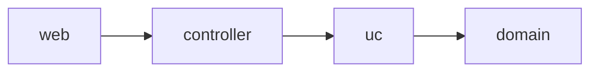

# ソフトウェアアーキテクチャ

## アーキテクチャ図
ドメイン駆動設計を採用しています。

- [web](api/app/web)は、APIサーバーの中でwebに関する関心事を持つ層です。
- [controller](api/app/controller)は、webからの入力をucが解釈できる形式に変換する責務を持つ層です。
- [uc (use case)](api/app/uc)は、アプリケーションビジネルルールの責務を持つ層であり、domainを呼び出してアプリケーションの処理を組み立てます。
- [domain](api/app/domain)は、エンタープライズビジネスルールの責務を持つ層です。
- [infra](api/app/infra) は、domainのインターフェースを実装する層です。

## アーキテクチャ思想
このプロダクトはビジネスロジックが複雑なので、その複雑さを管理するために、`domain`にビジネスルールが凝集するように設計をし、`uc`は`domain`に実装されているロジックを組み合わせてアプリケーションの処理を行うことに専念します。

## ドメイン層の実装

### ドメインモデル
ドメインモデルは、エンタープライズビジネスルールを実装する最初の手段です。ファクトリ(ドメインモデルを初期化するメソッド)やメソッドとして、ビジネスルールを実装してください。
もしビジネスルールをドメインモデルに実装するのが不自然なケースな場合は、サービスに実装をしましょう。

### サービス
サービスは、エンタープライズビジネスルールのうち、ドメインモデルの振る舞いとして実装するには不自然なものを実装するレイヤーです。インフラ層へのアクセスが必要な場合はインターフェースとして定義します。

### レポジトリ
レポジトリは、ドメインモデルのインスタンスを保存したり取得したりするレイヤーです。レポジトリにはコマンドとクエリの2つのパターンがあります。
- [コマンド](api/app/domain/command)は、ドメインモデルをデータベースに保存したり更新したりするなど、副作用が発生する処理を実行します。
- [クエリ](api/app/domain/query/)は、IDや特定の条件でドメインモデルを取得する処理を実行します。

レポジトリは基本的にインターフェースとして定義され、インフラ層がそのインターフェースを実装します。
